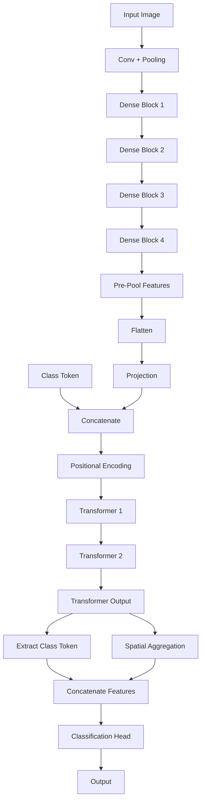

# CNN-Transformer Hybrid Model for Medical Image Classification

A PyTorch implementation of a hybrid CNN-Transformer model optimized for medical image classification tasks (specifically designed for chest X-ray analysis with small datasets). This model combines the powerful feature extraction capabilities of CNNs with the sequence modeling strengths of Transformers, with special considerations for limited training data.

## Table of Contents

* [Overview](#overview)

* [Model Architecture](#model-architecture)

* [Installation](#installation)

* [Dataset Preparation](#dataset-preparation)

* [Pretrained Weights](#pretrained-weights)

* [Training](#training)

* [Configuration](#configuration)

* [Results](#results)

* [Directory Structure](#directory-structure)

* [Features](#features)

## Overview

This implementation focuses on binary classification tasks (e.g., normal vs. pneumonia) using chest X-ray images. The model is specifically optimized for small datasets by:

* Using CheXNet pretrained weights (trained on chest X-rays) as the CNN backbone

* Implementing strategic layer freezing/unfreezing for transfer learning

* Incorporating regularization techniques (dropout, early stopping)

* Using conservative training parameters (smaller batch sizes, lower learning rates)

The hybrid architecture leverages CNNs for local feature extraction and Transformers for modeling global relationships between image regions, providing both discriminative power and interpretability through attention visualization.

## Model Architecture

The model consists of three main components:

1. **CNN Backbone**: DenseNet121 pretrained on ChestX-ray14 dataset (CheXNet weights)
* Extracts hierarchical visual features from input images

* Configurable layer freezing for transfer learning on small datasets

* Outputs 7x7 spatial feature maps (49 spatial locations)
1. **Transformer Encoder**:
* Positional encoding to capture spatial relationships

* Multiple encoder layers with multi-head self-attention

* Feed-forward networks with GELU activation

* Configurable number of layers and attention heads
1. **Classification Head**:
* Learnable class token for classification

* Feature fusion of class token and global spatial features

* Sigmoid output for binary classification

## Installation

### Prerequisites

* Python 3.8+

* PyTorch 1.10+

### Dependencies

Install required packages using pip:

```
pip install torch torchvision torchaudio

pip install numpy matplotlib scikit-learn seaborn tqdm
```

Or create a `requirements.txt` file:

```
torch>=1.10.0

torchvision>=0.11.1

numpy>=1.21.0

matplotlib>=3.4.3

scikit-learn>=0.24.2

seaborn>=0.11.2

tqdm>=4.62.3
```

Then install with:

```
pip install -r requirements.txt
```

## Dataset Preparation

The dataset should be organized in the following structure:

```
data/

├── train/

│   ├── NORMAL/

│   │   ├── image1.png

│   │   ├── image2.png

│   │   └── ...

│   └── PNEUMONIA/

│       ├── image1.png

│       ├── image2.png

│       └── ...

└── test/

   ├── NORMAL/

   │   └── ...

   └── PNEUMONIA/

       └── ...
```

* Images can be in any standard format (PNG, JPG, etc.)

* The code automatically handles conversion of single-channel (grayscale) X-rays to 3-channel format required by the CNN backbone

* Training data will be split into training and validation sets using the configured validation split ratio

## Pretrained Weights

The model uses CheXNet weights (pretrained on chest X-rays) for better initialization.

1. Download CheXNet weights from \[official source or trusted repository]

2. Place the weights file (`model.pth.tar`) in the path specified in the configuration (`../pretrained/model.pth.tar` by default)

3. If weights are not found, the model will use a randomly initialized DenseNet121 (not recommended for small datasets)

## Training

To start training, simply run:

```
python Transformer.py
```

The training process includes:

* Automatic creation of required directories (checkpoints, logs, results)

* Periodic logging to TensorBoard

* Saving of the best model based on validation loss

* Early stopping to prevent overfitting

* Visualization of feature maps and attention weights

## Configuration

All hyperparameters and settings are centralized in the `Config` class. Key parameters include:

| Category          | Parameters                                      | Description                                                    |
| ----------------- | ----------------------------------------------- | -------------------------------------------------------------- |
| Data              | `IMG_SIZE`, `BATCH_SIZE`, `VALIDATION_SPLIT`    | Image dimensions, batch size, and train/validation split ratio |
| Model             | `D_MODEL`, `NUM_HEADS`, `FFN_DIM`, `NUM_LAYERS` | Transformer dimensions and depth                               |
| Training          | `INIT_LR`, `EPOCHS`, `MIN_LR`, `PATIENCE`       | Learning rate schedule and training duration                   |
| Regularization    | `DROPOUT_RATE`                                  | Dropout probability for regularization                         |
| Transfer Learning | `FREEZE_CNN`, `FINE_TUNE_LAYERS`                | CNN freezing strategy for small datasets                       |

Modify these parameters in the `Config` class to adapt to your specific dataset and task.

## Results

After training, the following results will be generated:

1. **Model Checkpoints**:
* Best model (based on validation loss)

* Final model
1. **Evaluation Metrics**:
* Accuracy, precision, recall, F1-score

* Confusion matrix

* ROC curve with AUC score
1. **Visualizations**:
* Training/validation loss and accuracy curves

* CNN feature maps

* Transformer attention weights

* Input images (denormalized)
1. **TensorBoard Logs**:
* Loss and accuracy curves

* Gradient distributions

* Feature map visualizations

Results are saved in the `../results/` directory by default.

## Directory Structure

The code assumes the following directory structure (automatically created if missing):

```
project\_root/

├── data/                  # Dataset

│   ├── train/

│   └── test/

├── models/

│   └── checkpoints/       # Saved model weights

├── logs/                  # TensorBoard logs

├── results/               # Evaluation results and visualizations

└── pretrained/            # CheXNet weights
```

## Features

* **Small Dataset Optimization**: Specialized configuration for datasets with fewer than 10,000 images

* **Interpretability**: Visualization of attention weights to understand model decision-making

* **Comprehensive Logging**: Detailed training metrics and visualizations via TensorBoard

* **Robust Data Handling**: Automatic conversion of grayscale X-rays to 3-channel format

* **Transfer Learning**: Strategic layer freezing to leverage pretrained medical image features

* **Early Stopping**: Prevents overfitting on small datasets

* **Learning Rate Scheduling**: Adaptive learning rate reduction based on validation performance

This implementation provides a solid foundation for medical image classification tasks and can be adapted to other binary or multi-class classification problems with minimal modifications.


