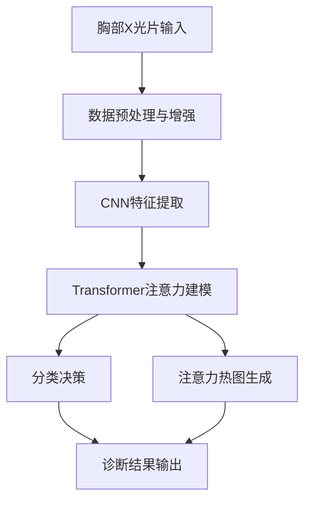
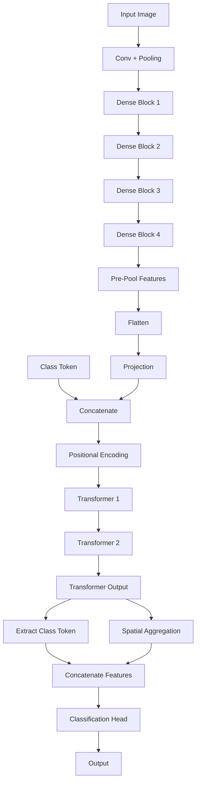

# 基于 CNN-Transformer 融合架构的胸部 X 光片肺炎智能诊断系统

## 一、项目背景

肺炎是全球范围内导致儿童和成人死亡的主要感染性疾病之一，早期精准诊断对降低死亡率至关重要。然而，基层医疗机构存在影像诊断人才匮乏、人工阅片效率低、漏诊误诊风险高等痛点。据统计，传统人工阅片对肺炎的漏诊率可达 15%-20%，严重影响患者治疗时机。

在此背景下，本项目旨在开发一套**高精度、具备可解释性的 AI 辅助诊断系统**，通过胸部 X 光片自动识别有无肺炎，为临床提供快速、可靠的决策支持，尤其适用于基层医疗场景的大规模筛查需求。

## 二、技术架构设计

### 1. 整体技术路线

采用“**CNN 特征提取 + Transformer 注意力建模**”的融合架构，充分结合 CNN 对局部特征的提取能力与 Transformer 对全局关联的建模优势，实现病灶的精准识别与可解释性分析。

### 2. 模块设计

* **数据预处理模块**：实现图像标准化、随机翻转 / 旋转等数据增强策略，缓解医疗数据样本量少的问题。

* **特征提取模块**：基于预训练 CNN提取肺部影像的多尺度特征，冻结底层权重以避免过拟合。

* **注意力建模模块**：引入 Transformer 编码器，通过多注意力头捕捉病灶区域与正常组织的全局关联，输出注意力权重用于可解释性分析。

* **分类决策模块**：通过全连接层输出 “正常 / 肺炎” 二分类结果，结合损失函数优化实现高召回率的临床需求。

### 3. 软硬件解决方案

* **软件栈**：基于 PyTorch 框架开发，利用企业人工智能开放平台（OPEA）提供的工具链实现模型训练与部署；支持 Docker 容器化封装。

* **硬件适配**：兼容 Intel x86 架构服务器及边缘设备，可根据实际场景选择 GPU 加速训练或 CPU 推理部署，满足从中心医院到基层诊所的不同算力需求。

### 4. 功能框图

## 三、性能测试评估

### 1. 核心指标

基于公开肺炎 X 光片数据集（780 例测试样本，正常 / 肺炎各 390 例），模型表现如下：

* 整体准确率：90.00%

* 肺炎召回率（灵敏度）：98.21%（仅 7 例肺炎漏诊）

* 正常样本精确率（特异度）：98.00%

* ROC 曲线下面积（AUC）：0.98

### 2. 关键可视化结果

* **混淆矩阵**：清晰展示模型对两类样本的分类分布，肺炎漏诊率极低，符合临床 “优先避免漏诊” 的需求。

* **ROC 曲线**：AUC=0.98，证明模型在不同决策阈值下的稳定性与区分能力。

* **注意力热图**：模型可精准聚焦肺部区域，直观解释决策逻辑，提升医生对 AI 结果的信任度。

## 四、技术创新点

1. **多模态特征融合**：将 CNN 的局部特征提取能力与 Transformer 的全局注意力机制结合，在医疗影像领域实现高精度与高可解释性的平衡。

2. **小样本训练优化**：通过冻结 CNN 底层权重、早停机制、学习率衰减等策略，在样本量有限的医疗场景中实现高效训练与泛化。

3. **医疗场景定制化**：针对肺炎诊断的临床痛点，优先优化召回率指标，同时保证正常样本的精确率，符合实际诊疗流程的需求。

## 五、企业落地应用价值

1. **基层医疗赋能**：为缺乏专业影像医生的基层诊所提供快速初筛工具，降低肺炎漏诊率，挽救更多患者生命。

2. **医生效率提升**：AI 系统可在秒级内完成诊断并生成注意力热图，辅助医生快速定位病灶，将阅片时间缩短 50% 以上。

3. **医疗成本降低**：减少因漏诊导致的后续重症治疗费用，同时降低不必要的进一步检查成本，为医疗机构节约资源。

本项目通过技术创新与临床需求的深度结合，为胸部疾病的 AI 辅助诊断提供了可落地、可信赖的解决方案，具备显著的社会价值与商业潜力。